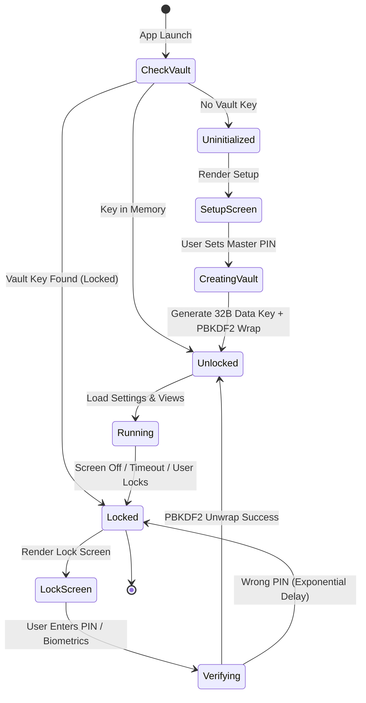
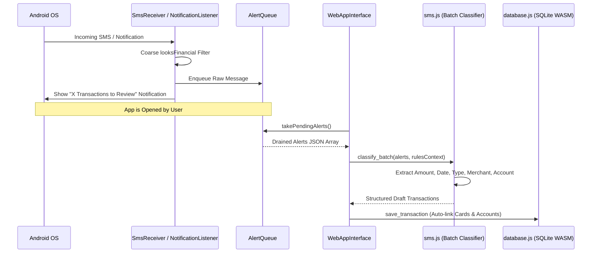
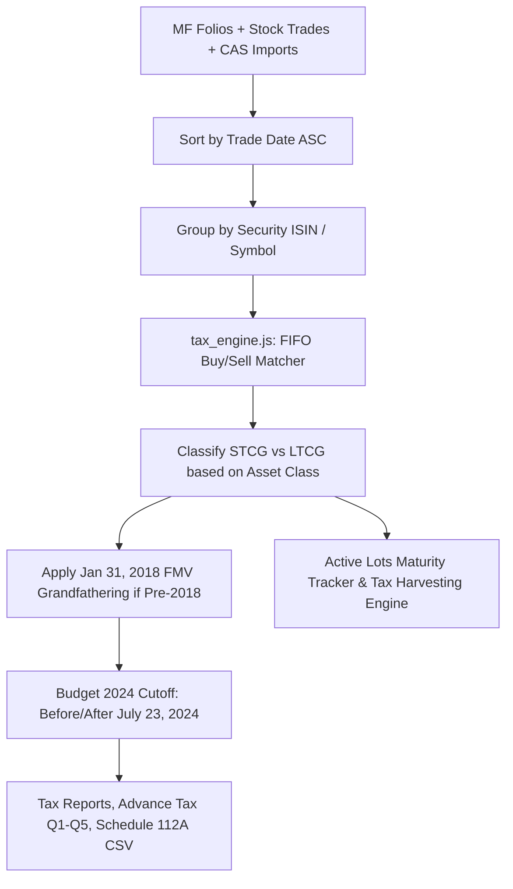

# Vitta Vriksha Architecture & System Design

This document details the architectural layers, data flows, state machines, and cryptographic boundaries of Vitta Vriksha. For detailed sub-system diagrams and feature flowcharts, see [FUNCTIONAL_FLOWS.md](./FUNCTIONAL_FLOWS.md).

---

## 1. System Topology

```mermaid
graph TD
    subgraph Native Shell [Android Native Layer (Kotlin)]
        MainActivity[MainActivity]
        WebAppInterface[WebAppInterface]
        Biometrics[BiometricHelper]
        Alarms[ReminderReceiver & AlarmManager]
        Alerts[SmsReceiver & NotificationListener]
        Queue[AlertQueue (SharedPreferences)]
    end

    subgraph Web Layer [Assets/WWW (ES Modules + WASM)]
        AppRouter[app.js (Router & State Controller)]
        Bridge[bridge.js (Bridge & Dispatcher)]
        Views[views/ (Home, Ledger, Investments, Tax, etc.)]
        BackendRouter[backend/index.js]
        SQLiteWASM[backend/database.js + sqlite.wasm]
        WebCrypto[backend/vault.js + crypto.js]
        Parsers[vendor/casparser.js + pdf.js + broker_parser.js]
    end

    MainActivity -->|Hosts WebView| AppRouter
    Views -->|Bridge.db / Bridge.call| Bridge
    Bridge -->|Calls JS Backend| BackendRouter
    Bridge -->|Calls AndroidBridge| WebAppInterface
    BackendRouter --> SQLiteWASM
    BackendRouter --> WebCrypto
    BackendRouter --> Parsers
    Alerts -->|looksFinancial Filter| Queue
    WebAppInterface -->|takePendingAlerts| Queue
    WebAppInterface --> Biometrics
    WebAppInterface --> Alarms
```

---

## 2. Vault & Cryptographic State Machine

The entire SQLite database file is encrypted on disk using AES-256-GCM. The user PIN is never stored or compared in cleartext.



---

## 3. Financial SMS & Notification Ingestion Pipeline

Incoming bank messages are captured in the background without waking the JavaScript engine, ensuring high battery efficiency.



---

## 4. Statutory FIFO Capital Gains & Tax Engine Flow

Complies with Section 111A, Section 112A (with Jan 31, 2018 Grandfathering), Section 50AA (Debt), and Budget 2024 (July 23, 2024 Regime Split).



---

## 5. Security Invariants

1. **Zero Cleartext Credentials**: PIN is PBKDF2-derived with random salt.
2. **Deterministic Foreign Key Integrity**: Backups are written and restored in strict topological dependency order (`family_members` -> `asset_accounts` -> `credit_cards` -> `transactions` -> `splits`/`cashbacks`).
3. **No Unbounded Memory Growth**: In-memory reference caches (`isinNameCache`, `navCache`, `directIsinCache`) and AlertQueue (bounded at 200 items) protect against device memory pressure.
4. **Timezone-Safe Financial Dates**: All business dates and calendar math use local calendar parsers (`parseISO`, `isoDate`, `today()`) rather than UTC `.toISOString()`.

