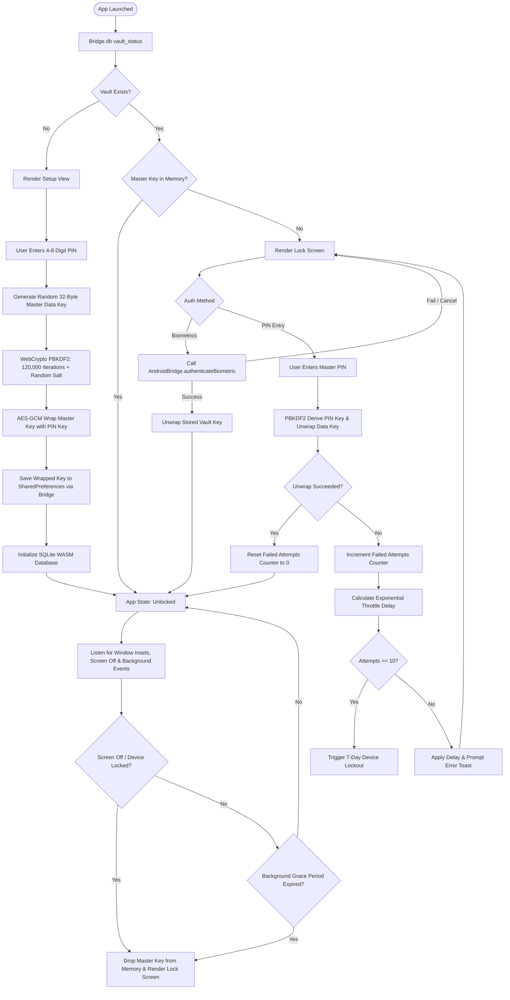
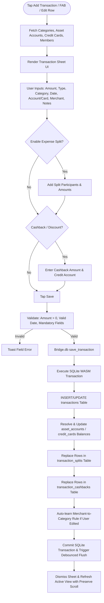

# Vitta Vriksha - Functional Flowcharts & Feature Architecture

This document contains end-to-end functional flowcharts for every subsystem and feature in Vitta Vriksha. These diagrams serve as visual specifications for developers, code reviewers, and system audits to verify accuracy, detect edge cases, and maintain architectural integrity.

---

## Table of Contents
1. [Core Vault & Security Lifecycle](#1-core-vault--security-lifecycle)
2. [Transaction Recording, Splits & Ledger Flow](#2-transaction-recording-splits--ledger-flow)
3. [SMS & Notification Ingestion Pipeline](#3-sms--notification-ingestion-pipeline)
4. [Mutual Fund & CAS Statement Import Engine](#4-mutual-fund--cas-statement-import-engine)
5. [Stock & Demat Tradebook CSV Ingestion](#5-stock--demat-tradebook-csv-ingestion)
6. [Statutory FIFO Capital Gains & Tax Engine](#6-statutory-fifo-capital-gains--tax-engine)
7. [Wealth Intelligence & Portfolio Optimization](#7-wealth-intelligence--portfolio-optimization)
8. [Cashflow, Safe-to-Spend & Runway Forecaster](#8-cashflow-safe-to-spend--runway-forecaster)
9. [Debt Payoff, Part-Payment & DTI Analysis](#9-debt-payoff-part-payment--dti-analysis)
10. [Reminders, Daily Review & Alarm System](#10-reminders-daily-review--alarm-system)
11. [Encrypted Backup & Database Restore Engine](#11-encrypted-backup--database-restore-engine)
12. [Household & Multi-Member Lifecycle](#12-household--multi-member-lifecycle)

---

## 1. Core Vault & Security Lifecycle



---

## 2. Transaction Recording, Splits & Ledger Flow



---

## 3. SMS & Notification Ingestion Pipeline

```mermaid
flowchart TD
    subgraph Background Native Layer
        SMSIn([Incoming Bank SMS]) --> SMSRecv[SmsReceiver.onReceive]
        NotifIn([Incoming Payment App Notification]) --> NotifRecv[TransactionNotificationListener.onNotificationPosted]

        SMSRecv --> CoarseFilter{looksFinancial Test: Currency Symbol / Keywords?}
        NotifRecv --> CoarseFilter

        CoarseFilter -->|No| DropMsg([Ignore & Discard])
        CoarseFilter -->|Yes| Enqueue[AlertQueue.add: Store in Private SharedPreferences (Limit 200)]
        Enqueue --> PostNotification[ReminderNotificationManager: Show 'X Transactions to Review' Alert]
    end

    PostNotification --> UserOpensApp([User Opens Vitta Vriksha])
    UserOpensApp --> AppResume[App.catchUp / App.resume Lifecycle]
    AppResume --> TakeAlerts[WebAppInterface.takePendingAlerts: Drains SharedPreferences Queue]
    TakeAlerts --> BatchClassifier[sms.js: classify_batch]

    subgraph Batch Classification Engine
        BatchClassifier --> BuildContext[Build Pre-cached Rules Context: Merchant Rules, Regex Patterns, Accounts, Cards]
        BuildContext --> LoopAlerts[Iterate Drained Messages]
        LoopAlerts --> ExtractAmount[Extract Amount: DEFAULT_AMOUNT_RE]
        ExtractAmount --> ExtractDate[Extract Date: DATE_PATTERNS]
        ExtractDate --> ExtractMerchant[Extract Merchant & Clean Noise Tokens]
        ExtractMerchant --> MatchRule{Match Learned / Pre-defined Rule?}
        MatchRule -->|Match Found| ApplyRule[Assign Category, Type, Investment Flag]
        MatchRule -->|Fallback| MatchHeuristics[Heuristic Classifier: Debit/Credit, ATM, Transfer]
        ApplyRule --> MatchAccount[Match Account/Card from Last-4 Digits in Text]
        MatchHeuristics --> MatchAccount
        MatchAccount --> NextAlert{More Alerts?}
        NextAlert -->|Yes| LoopAlerts
        NextAlert -->|No| ReturnBatch[Return Structured Drafts Array]
    end

    ReturnBatch --> TooltipCheck{Display Mode?}
    TooltipCheck -->|Home Dashboard| ShowTooltip[Render Interactive Alert Tooltip Card]
    TooltipCheck -->|SMS Review Screen| StreamReview[Render Streaming SMS Review View (rules.js)]

    ShowTooltip --> OneTapAccept[Tap Accept / Discard / Edit]
    StreamReview --> BulkActions[Select All / Bulk Accept / Bulk Discard]

    OneTapAccept --> SaveDB[database.js: save_transaction]
    BulkActions --> SaveDB
```

---

## 4. Mutual Fund & CAS Statement Import Engine

```mermaid
flowchart TD
    PickCAS([User Taps Import CAS PDF]) --> OpenPicker[Android Document Picker: MIME application/pdf]
    OpenPicker --> ReadBytes[Read PDF File Bytes as Uint8Array via FileReader]
    ReadBytes --> PDFPreflight[PDF Header Validation: %PDF- Signature Check]

    PDFPreflight -->|Invalid| ErrPDF[Fail: CAS_INVALID_FILE]
    PDFPreflight -->|Valid| PasswordPrompt[Prompt Statement Password Dialog (PAN / DOB)]

    PasswordPrompt --> LoadPDFJS[Initialize vendor/pdf.js Worker]
    LoadPDFJS --> ExtractPages[Extract Raw Page Text Streams]

    ExtractPages --> PreflightScore[Score Text against STATEMENT_MARKERS: CAMS, KFintech, CDSL, NSDL]
    PreflightScore --> DetectIssuer{Issuer Identified?}
    DetectIssuer -->|No| ErrLayout[Fail: CAS_UNREADABLE_LAYOUT]
    DetectIssuer -->|Yes| ParseCAS[vendor/casparser.js Parser Execution]

    ParseCAS --> ExtractFolios[Extract Investor Info, Folios, ISINs, Schemes, NAVs, Units, Transactions]
    ExtractFolios --> ShowProgress[showProgressModal: Processing X Folios]

    ShowProgress --> DBReconcile[backend/cas.js: reconcile_holdings]
    DBReconcile --> StartSQLTxn[Begin SQLite WASM Transaction]
    StartSQLTxn --> UpsertFolios[INSERT OR REPLACE into mf_folios]
    UpsertFolios --> UpsertDemat[INSERT OR REPLACE into demat_holdings]
    UpsertDemat --> UpsertTxns[INSERT OR REPLACE into folio_transactions]
    UpsertTxns --> MatchISIN[Resolve Scheme Names & Direct/Regular Status via isin.db]
    MatchISIN --> CommitCAS[Commit SQLite Transaction & Update last_cas_upload_date]
    CommitCAS --> SuccessToast[Show Import Success Modal with Summary Statistics]
```

---

## 5. Stock & Demat Tradebook CSV Ingestion

```mermaid
flowchart TD
    PickCSV([User Taps Import Tradebook CSV]) --> FileSelect[File Picker: MIME text/csv, text/plain]
    FileSelect --> ParseLines[broker_parser.js: parseCsvLines (RFC 4180 Parser)]
    ParseLines --> HeaderDetect[Scan Top 10 Lines for Column Headers]

    HeaderDetect --> MapHeaders{Identify Headers: Date, Symbol/ISIN, Type, Qty, Price?}
    MapHeaders -->|Missing| ErrCols[Fail: CSV_MISSING_COLUMNS]
    MapHeaders -->|Identified| DetectBroker[Detect Broker Format: Zerodha, Groww, Upstox, AngelOne, Generic]

    DetectBroker --> IterateRows[Iterate Trade Rows]
    IterateRows --> NormalizeDate[Normalize Date to YYYY-MM-DD]
    NormalizeDate --> CleanNumbers[Clean Quantity, Execution Price, STT, Brokerage Charges]
    CleanNumbers --> NormalizeSide[Normalize Trade Type: BUY / SELL]
    NormalizeSide --> ISINResolve[Resolve ISIN & Security Name via isin.js Cache]
    ISINResolve --> AppendTxn[Append to Valid Transactions List]

    AppendTxn --> HasMoreRows{More Rows?}
    HasMoreRows -->|Yes| IterateRows
    HasMoreRows -->|No| BatchImport[backend/database.js: import_stock_transactions]

    BatchImport --> SQLStockTxn[INSERT into stock_transactions]
    SQLStockTxn --> UpdateDematHoldings[Recalculate demat_holdings Net Quantities & Average Costs]
    UpdateDematHoldings --> Finish[Show Imported vs Skipped Row Count & Refresh Investments View]
```

---

## 6. Statutory FIFO Capital Gains & Tax Engine

```mermaid
flowchart TD
    StartTax([User Opens Tax View / Requests FY Tax Report]) --> FetchTxns[Query folio_transactions + stock_transactions for Member]
    FetchTxns --> SortFIFO[tax_engine.js: Sort All Buys & Sells by Date ASC]

    SortFIFO --> GroupSecurity[Group Transactions by Security ISIN / Symbol]
    GroupSecurity --> FIFOLoop[Iterate Securities]

    subgraph FIFO Lot Matching Engine
        FIFOLoop --> QueueBuys[Create Buy Lots FIFO Queue]
        QueueBuys --> MatchSells[Iterate Sell Transactions]
        MatchSells --> ConsumeLots[Consume Buy Lots Chronologically]
        ConsumeLots --> CalcHoldingDays[Compute Holding Period: Sale Date - Purchase Date]
        CalcHoldingDays --> AssetRules{Asset Class Rules}
        AssetRules -->|Listed Equity / Equity MF| EquityClass[STCG <= 365 Days < LTCG]
        AssetRules -->|Debt MF (Post Apr 1, 2023)| DebtClass[Section 50AA: Always STCG / Slab Rate]
        AssetRules -->|Unlisted / Other| OtherClass[STCG <= 730 Days < LTCG]

        EquityClass --> GrandfatherCheck{Purchased on/before 31-Jan-2018?}
        GrandfatherCheck -->|Yes| ApplySec112A[Calculate Grandfathered Cost: max(Cost, min(FMV_Jan31_2018, SalePrice))]
        GrandfatherCheck -->|No| ActualCost[Cost Basis = Actual Purchase Price]

        ApplySec112A --> RegimeCheck{Sold on/after 23-Jul-2024?}
        ActualCost --> RegimeCheck

        RegimeCheck -->|Before Cutoff| OldRates[Old Regime: STCG 15%, LTCG 10%]
        RegimeCheck -->|On/After Cutoff| NewRates[Budget 2024 Regime: STCG 20%, LTCG 12.5%]

        OldRates --> RealizedGain[Record Realized Gain Lot]
        NewRates --> RealizedGain

        RealizedGain --> AdvanceTaxMap[Map Sale Date to Advance Tax Quarter: Q1, Q2, Q3, Q4, Q5]
    end

    AdvanceTaxMap --> OpenLotsTracker[Process Remaining Unsold Units into Active Open Lots]
    OpenLotsTracker --> MaturityCountdown[Calculate Days to 365-Day LTCG Maturity for Open Lots]

    MaturityCountdown --> TaxHarvestCalc[wealth_intel.js: calculateTaxHarvesting]
    TaxHarvestCalc --> ExemptionMath[Apply ₹1.25 Lakh Annual LTCG Exemption Limit]
    ExemptionMath --> OutputTaxReport[Render FY Capital Gains Summary, Schedule 112A CSV & Harvest Alerts]
```

---

## 7. Wealth Intelligence & Portfolio Optimization

```mermaid
flowchart TD
    RequestIntel([User Navigates to Wealth Intelligence / Insights]) --> QueryHoldings[Fetch Balances across asset_accounts, mf_folios, demat_holdings, nps_holdings]

    QueryHoldings --> ParallelCalculators{Execute Analytics Modules}

    subgraph Portfolio Rebalancer
        ParallelCalculators --> Rebalance[calculatePortfolioRebalance]
        Rebalance --> SumClasses[Group Assets: Equity, Debt, Gold, Alternative]
        SumClasses --> TargetCompare[Compare Actual % vs Target Allocation %]
        TargetCompare --> SIPRoute[Calculate Deficit Gaps & Route Monthly SIP Budget to Underweight Assets]
    end

    subgraph Passive Yield Run-Rate
        ParallelCalculators --> YieldCalc[calculatePassiveYield]
        YieldCalc --> Sum12mPassive[Sum Income Transactions from Category: Dividend, Interest over Past 12M]
        Sum12mPassive --> RunRate[Compute Monthly Passive Run-Rate & Portfolio Yield %]
    end

    subgraph Direct vs Regular Drag
        ParallelCalculators --> DragCalc[calculateDirectVsRegularDrag]
        DragCalc --> CompoundDiff[Simulate 20-Year Future Wealth with 0.5% TER vs 1.5% TER]
        CompoundDiff --> LostWealth[Calculate Cumulative Distributor Commission Lost in ₹ and %]
    end

    subgraph SGB & FD Schedules
        ParallelCalculators --> SgbCalc[calculateSgbSchedule & calculateFdLadder]
        SgbCalc --> SgbInterest[Calculate 2.5% Semi-annual Sovereign Gold Bond Coupon Schedule]
        SgbCalc --> FdMaturity[Calculate FD Quarterly Compounded Maturity Values & Days Remaining]
    end

    subgraph Real Returns & Milestones
        ParallelCalculators --> RealReturnCalc[calculateRealReturn & getNetWorthMilestones]
        RealReturnCalc --> FisherEq[Apply Fisher Equation: (1 + Nominal) / (1 + Inflation) - 1]
        RealReturnCalc --> MilestoneProgress[Calculate Distance & % Progress to Next Net Worth Milestone: ₹1L to ₹10Cr]
    end

    SIPRoute --> RenderWealthView[Render Wealth Overview, Charts, Cards & Action Plans]
    RunRate --> RenderWealthView
    LostWealth --> RenderWealthView
    SgbInterest --> RenderWealthView
    FdMaturity --> RenderWealthView
    FisherEq --> RenderWealthView
    MilestoneProgress --> RenderWealthView
```

---

## 8. Cashflow, Safe-to-Spend & Runway Forecaster

```mermaid
flowchart TD
    StartCashflow([Open Cashflow / Safe-to-Spend Widget]) --> GetLiquid[Sum Liquid Balances: Bank Accounts, Cash, Wallets]
    GetLiquid --> GetCommitments[Aggregate Month Commitments]

    subgraph Commitments Aggregator
        GetCommitments --> SumEMIs[Sum Monthly Loan EMIs]
        GetCommitments --> SumSIPs[Sum Active Monthly SIPs]
        GetCommitments --> SumCC[Sum Credit Card Outstanding Balances]
        GetCommitments --> SumBills[Sum Recurring Subscriptions with auto_debit = 1]
        SumEMIs --> TotalLocked[Locked Commitments = EMIs + SIPs + CC Dues + Bills]
        SumSIPs --> TotalLocked
        SumCC --> TotalLocked
        SumBills --> TotalLocked
    end

    TotalLocked --> SafeMath[Safe Total = max(0, Liquid Balance - Locked Commitments)]
    SafeMath --> DailyMath[Safe Daily = Safe Total / Days Remaining in Current Month]
    DailyMath --> StatusDiagnosis{Liquid >= Locked?}
    StatusDiagnosis -->|No| StatusDeficit[Health Status: Deficit]
    StatusDiagnosis -->|Yes, Safe < 15%| StatusTight[Health Status: Tight]
    StatusDiagnosis -->|Yes, Safe >= 15%| StatusHealthy[Health Status: Healthy]

    StatusHealthy --> RunwaySim[Project 30-Day Runway Trajectory]
    StatusTight --> RunwaySim
    StatusDeficit --> RunwaySim

    subgraph 30-Day Day-by-Day Projection
        RunwaySim --> EstimateDailyBurn[Compute Average Daily Discretionary Spend from Past 30 Days]
        EstimateDailyBurn --> DayLoop[Iterate Day 1 to 30]
        DayLoop --> ApplyDebits[Apply Scheduled SIPs and CC Due Payments on Respective Calendar Days]
        DayLoop --> ApplySalary[Apply Expected Salary Credit on Learned Payday]
        ApplyDebits --> StepBalance[Project Day-End Balance = Previous - Debits - DailyBurn + Credits]
        ApplySalary --> StepBalance
        StepBalance --> CheckMin[Track Minimum Projected Balance over 30 Days]
        CheckMin --> NextDay{More Days?}
        NextDay -->|Yes| DayLoop
        NextDay -->|No| RunwayResult[Return Runway Safety Flag: is_runway_safe: MinBalance >= 5000]
    end

    RunwayResult --> RenderUI[Render Safe-to-Spend Card, Runway Timeline & Salary Checklist]
```

---

## 9. Debt Payoff, Part-Payment & DTI Analysis

```mermaid
flowchart TD
    StartDebt([User Opens Debt & Loans Planner]) --> FetchDebts[Query Active Loans (borrowed) + Credit Cards with Balance > 0]
    FetchDebts --> CheckZero{Any Active Debts?}
    CheckZero -->|No| ZeroDebt[Display 'Zero Debt Obligations' Badge]
    CheckZero -->|Yes| SimEngines[Execute Debt Simulation Engines]

    subgraph Avalanche vs Snowball Simulation
        SimEngines --> SortAvalanche[Avalanche: Sort Debts by Interest Rate DESC]
        SimEngines --> SortSnowball[Snowball: Sort Debts by Current Balance ASC]

        SortAvalanche --> RunAvalancheSim[simulatePayoff: Apply Monthly Interest -> Pay Minimums -> Direct Extra Cash to Top Debt]
        SortSnowball --> RunSnowballSim[simulatePayoff: Apply Monthly Interest -> Pay Minimums -> Direct Extra Cash to Smallest Balance]

        RunAvalancheSim --> ComparePayoffs[Compare Total Interest Paid & Months to Debt Freedom]
    end

    subgraph Home Loan Part-Payment Calculator
        SimEngines --> PartPaymentCalc[calculateHomeLoanPartPayment]
        PartPaymentCalc --> BaseEMI[Calculate Base EMI using Standard Amortization Formula]
        BaseEMI --> ExtraEMIScenario[Simulate 1 Extra EMI Paid Every 12th Month]
        BaseEMI --> StepUpScenario[Simulate 5% / 10% Annual Step-up in EMI]
        ExtraEMIScenario --> SavingsMath[Compute Years Saved & Interest Saved in ₹]
        StepUpScenario --> SavingsMath
    end

    subgraph DTI Ratio & Credit Utilization
        SimEngines --> DTICalc[calculateDtiRatio]
        DTICalc --> SumObligations[Monthly Debt Obligations = Loan EMIs + 5% CC Minimum Dues]
        SumObligations --> GetIncome[Monthly Income = Latest Salary / 3-Month Average]
        GetIncome --> RatioMath[DTI % = Obligations / Income * 100]
        RatioMath --> DTIRating{DTI Ratio}
        DTIRating -->|DTI <= 30%| DTIHealthy[Healthy: <30%]
        DTIRating -->|30% < DTI <= 45%| DTIModerate[Moderate: 30-45%]
        DTIRating -->|DTI > 45%| DTIHigh[High Risk: >45%]
    end

    ComparePayoffs --> RenderDebtView[Render Payoff Roadmap, Prepayment Recommendations & DTI Badge]
    SavingsMath --> RenderDebtView
    DTIHealthy --> RenderDebtView
    DTIModerate --> RenderDebtView
    DTIHigh --> RenderDebtView
```

---

## 10. Reminders, Daily Review & Alarm System

```mermaid
flowchart TD
    AppLaunchOrSync([App Launch / Resume / Periodic Sync]) --> CheckVault{Vault Unlocked?}
    CheckVault -->|No (Locked)| SilentReturn([Return Cleanly without Querying Encrypted DB])
    CheckVault -->|Yes| CheckReminders[backend/reminders.js: checkReminders]

    subgraph Reminder Evaluators
        CheckReminders --> CASCheck{last_cas_upload_date >= 30 Days Ago?}
        CASCheck -->|Yes| PushCAS[Add CAS_REFRESH Reminder: 'Time to refresh statement']
        CASCheck -->|No| SIPCheck

        PushCAS --> SIPCheck[Query Active SIPs]
        SIPCheck --> SIPDue{Debit Day within 3 Days?}
        SIPDue -->|Yes| PushSIP[Add SIP_DUE Reminder: 'Instalment due in X days']
        SIPDue -->|No| EventCheck

        PushSIP --> EventCheck[Query custom_events with event_date >= Today]
        EventCheck --> EventDue{Event within Reminder Notice Window?}
        EventDue -->|Yes| PushEvent[Add CUSTOM_EVENT Reminder]
        EventDue -->|No| DailyReviewCheck

        PushEvent --> DailyReviewCheck{Daily Evening Review Enabled?}
        DailyReviewCheck -->|Yes & No SMS| PushReview[Add DAILY_REVIEW Reminder at Target Time: e.g. 21:00]
        DailyReviewCheck -->|No| FinishCheck
        PushReview --> FinishCheck[Return Reminders Array]
    end

    FinishCheck --> SyncAlarms[reminders.js: syncReminders]
    SyncAlarms --> LoopReminders[Iterate Reminders]
    LoopReminders --> BridgeCancel[Call AndroidBridge.cancelReminder(id)]
    BridgeCancel --> BridgeSchedule[Call AndroidBridge.scheduleReminder(id, triggerTime, title, body)]
    BridgeSchedule --> AlarmManager[Android OS AlarmManager.set(RTC_WAKEUP, triggerTime, PendingIntent)]

    AlarmManager --> AlarmFires([Alarm Moment Arrives])
    AlarmFires --> Receiver[ReminderReceiver.onReceive]
    Receiver --> PostSysNotif[ReminderNotificationManager: Show System Notification with Action Intent]
    PostSysNotif --> UserTapsNotif([User Taps Notification])
    UserTapsNotif --> OpenTarget[MainActivity.handleNotificationIntent -> App.handleNotificationClick]
    OpenTarget --> RoutePage[Navigate to Relevant Subpage: CAS, SIPs, or Transaction Sheet]
```

---

## 11. Encrypted Backup & Database Restore Engine

```mermaid
flowchart TD
    subgraph Export Backup Flow
        UserExport([User Requests Export Backup]) --> PasswordPrompt[Prompt Strong Password (Min 8 Characters)]
        PasswordPrompt --> ValidatePW[Verify Password Strength]
        ValidatePW --> FetchData[Serialize All Tables in BACKUP_TABLES Order]
        FetchData --> GenSalt[Generate 16-Byte Cryptographic Salt & 12-Byte Nonce]
        GenSalt --> PBKDF2Export[PBKDF2: 600,000 Iterations -> 256-Bit AES Key]
        PBKDF2Export --> EncryptGCM[WebCrypto AES-256-GCM Encrypt JSON Payload]
        EncryptGCM --> CreateBlob[Assemble Encrypted Payload with Magic Header & Metadata]
        CreateBlob --> ShareOrSave{Share Sheet or Save to Downloads?}
        ShareOrSave -->|Share| ShareFile[AndroidBridge.shareFile -> Intent.ACTION_SEND]
        ShareOrSave -->|Save| SaveFile[AndroidBridge.saveFile -> MediaStore.Downloads]
    end

    subgraph Import Backup Flow
        UserImport([User Picks .vittavriksha Backup File]) --> ReadEncrypted[Read File Text / Bytes]
        ReadEncrypted --> EnterImportPW[Prompt Decryption Password]
        EnterImportPW --> PBKDF2Import[Derive 256-Bit Key via PBKDF2 600,000 Iterations]
        PBKDF2Import --> DecryptGCM[AES-256-GCM Decrypt Payload]
        DecryptGCM -->|Decryption Failed| ErrPW[Fail: BACKUP_DECRYPT_FAILED]
        DecryptGCM -->|Success| ParseJSON[Parse Decrypted JSON Object]

        ParseJSON --> VersionCheck{Backup Version <= Current App Version?}
        VersionCheck -->|No| ErrVer[Fail: BACKUP_VERSION_NEWER]
        VersionCheck -->|Yes| BeginRestoreTxn[Begin SQLite WASM Transaction]

        BeginRestoreTxn --> ClearTables[DELETE FROM All Tables in Reverse Dependency Order]
        ClearTables --> InsertTables[INSERT Rows into Tables in Forward Topological Order]
        InsertTables --> VerifyFKs[PRAGMA foreign_key_check]
        VerifyFKs -->|FK Violations| Rollback[Rollback SQLite Transaction & Restore Previous State]
        VerifyFKs -->|Valid| CommitRestore[Commit Transaction & Flush Encrypted DB File]
        CommitRestore --> RestartApp[App.restart: Re-initialize Schema & Reload State]
    end
```

---

## 12. Household & Multi-Member Lifecycle

```mermaid
flowchart TD
    StartHousehold([Household Management Screen]) --> FetchMembers[Bridge.db get_family_members]
    FetchMembers --> RenderMembersList[Render Family Members, Avatars & Primary Badges]

    RenderMembersList --> UserAction{Member Action}

    UserAction -->|Add Member| AddMemberDialog[Open Add Member Sheet: Name, Relationship, Avatar Color]
    AddMemberDialog --> SaveMember[Bridge.db save_family_member]
    SaveMember --> InsertMemberDB[INSERT INTO family_members Table]
    InsertMemberDB --> RefreshMembers[Refresh UI & Update Global Member Switcher]

    UserAction -->|Filter by Member| SwitchMember[Select Member in Top Bar / Filter Drawer]
    SwitchMember --> SetFilterState[Set app.memberFilter = member_id / 'all']
    SetFilterState --> ReQueryViews[All Views & Widgets Re-query with WHERE member_id = ?]

    UserAction -->|Delete Secondary Member| DeletePrompt[Prompt Deletion Confirmation]
    DeletePrompt --> PrimaryCheck{Is Member Primary?}
    PrimaryCheck -->|Yes| RefusePrimary[Fail: MEMBER_PRIMARY (Cannot delete primary user)]
    PrimaryCheck -->|No| ExecuteDelete[Bridge.db delete_family_member]

    ExecuteDelete --> CascadeReassign[Reassign All Records to Primary Member (ID: 1): Accounts, Cards, Loans, Txns]
    CascadeReassign --> DeleteRow[DELETE FROM family_members WHERE id = ?]
    DeleteRow --> ResetFilter[Reset Active Member Filter to 'all' & Refresh Screen]
```

